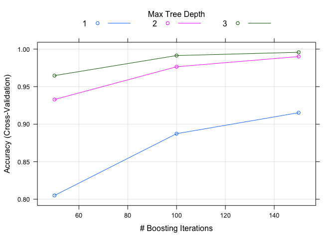
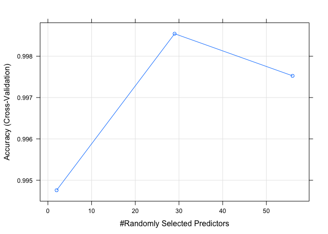

## Background
Using devices such as Jawbone Up, Nike FuelBand, and Fitbit it is now possible to collect a large amount of data about personal activity relatively inexpensively. These type of devices are part of the quantified self movement – a group of enthusiasts who take measurements about themselves regularly to improve their health, to find patterns in their behavior. One thing that people regularly do is quantify how much of a particular activity they do, but they rarely quantify how well they do it. In this project, my goal will be to predict it using data from accelerometers on the belt, forearm, arm, and dumbell of 6 participants. They were asked to perform barbell lifts correctly and incorrectly in 5 different ways. Data provided by project on human activity recognition: http://web.archive.org/web/20161224072740/http:/groupware.les.inf.puc-rio.br/har

## Getting and cleaning data
First of all, I will load libraries and get train and test data sets    .

```r
library(caret)
library(dplyr)
library(gbm)
library(doParallel)
if (!file.exists("./data"))
    dir.create("./data")
if (!file.exists("./data/pml-training.csv"))
{
    fileURL = "https://d396qusza40orc.cloudfront.net/predmachlearn/pml-training.csv"
    download.file(fileURL, "./data/pml-training.csv",method = "curl")
}
if (!file.exists("./data/pml-testing.csv"))
{
    fileURL = "https://d396qusza40orc.cloudfront.net/predmachlearn/pml-testing.csv"
    download.file(fileURL, "./data/pml-testing.csv",method = "curl")
}
```
Now I need to load data in R. I've done it several times and noticed that almost all
my variables are factor variables because they include symbols "NA" and "#DIV/0!",
which can't be converted to numeric variables. So, I'll tell R that this symbols
are NAs.

```r
training = read.csv("./data/pml-training.csv", na.strings = c("","NA","#DIV/0!"))
testing = read.csv("./data/pml-testing.csv", na.strings = c("","NA","#DIV/0!"))
```
I want to check how much data do I have.

```r
dim(training);dim(testing)
```

```
## [1] 19622   160
```

```
## [1]  20 160
```
In order to fit models I should clean my data from NAs. How much NAs do I have?

```r
colNAs = colSums(is.na(training))
colNAs[13:14]
```

```
## kurtosis_picth_belt   kurtosis_yaw_belt 
##               19248               19622
```
I don't want to show all colNAs, it's quite long, but it's obvious that a lot of
variable have more than 19000 NAs out of 19622 values. I will exclude
those variables and check NAs after that.

```r
nav = names(colNAs[colNAs > 19000])
training = select(training, -nav)
table(is.na(training))
```

```
## 
##   FALSE 
## 1177320
```
No NAs! It's much better. Now, I want to remove nearZeroVar's as they don't contribute
to a prediction.

```r
zv = nearZeroVar(training)
training = training[, -zv]
```
Now, let's look at first to columns in training.

```r
training[1:3, 1:5]
```

```
##   X user_name raw_timestamp_part_1 raw_timestamp_part_2   cvtd_timestamp
## 1 1  carlitos           1323084231               788290 05/12/2011 11:23
## 2 2  carlitos           1323084231               808298 05/12/2011 11:23
## 3 3  carlitos           1323084231               820366 05/12/2011 11:23
```
X is a row number, if I use it as predictor, it will ruin my prediction. cvtd_timestamp
is now a factor variable (not convinient, I have to convert it) and is not important (it
is just a date of experiment, we have it in other columns). So, I will remove it too. In the next chunk of code I will clean training and testing - in the
same way.

```r
training = training[, -1]
training = select(training, -cvtd_timestamp)

testing = select(testing, -nav)
testing = testing[, -zv]
testing = testing[, -1]
testing = select(testing, -cvtd_timestamp)
dim(training);dim(testing)
```

```
## [1] 19622    57
```

```
## [1] 20 57
```
Only 56 predictors! Let's now fit a model.

## Fitting models
I'm going to fit models using "classe" as outcome and all the other variables as
predictors. I'll use caret function train and cross validation with 5 folders to fit
the best model on a part of training data and after that I'll eatimate accuracy
(and out of sample error, which is 1 - accuracy) on an other part of training data.

In the next chunk of code I'll create training0 and testing0 from training and create
my own trainControl function - with cross validation.

```r
inTrain = createDataPartition(y = training$classe, p = 0.7, list = F)
training0 = training[inTrain,]
testing0 = training[-inTrain,]
predictorsDF = select(training0, -"classe")
fitControl <- trainControl(method = "cv",
                           number = 5,
                           allowParallel = TRUE)
```
I'm going to try 2 types of models - Generalized Boosted Regression Model (gbm) and
Random Forest (rf). I've tried them on my computer several tymes - and they are
very-very time consuming. So, I will fit them in parallel.

```r
cl <- makePSOCKcluster(detectCores() - 1)
registerDoParallel(cl)
modFit1 = train(x = predictorsDF, y = training0$classe, method = "gbm", verbose = F,
                trControl = fitControl)
stopCluster(cl)
registerDoSEQ()
```
Let's see Accuracy on training0 and testing0, table on testing0 and model's plot.

```r
confusionMatrix(predict(modFit1), training0$classe)$overall[1]
```

```
##  Accuracy 
## 0.9983985
```

```r
confusionMatrix(predict(modFit1, testing0), testing0$classe)$overall[1]
```

```
##  Accuracy 
## 0.9962617
```

```r
confusionMatrix(predict(modFit1, testing0), testing0$classe)$table
```

```
##           Reference
## Prediction    A    B    C    D    E
##          A 1673    0    0    0    0
##          B    1 1137    0    0    1
##          C    0    2 1022    4    0
##          D    0    0    4  956    6
##          E    0    0    0    4 1075
```

```r
plot(modFit1)
```

<!-- -->

Our prediction is:

```r
resPred1 = predict(modFit1, testing)
```
Now, to rf:

```r
cl <- makePSOCKcluster(detectCores() - 1)
registerDoParallel(cl)
modFit2 = train(x = predictorsDF, y =training0$classe, method = "rf", trControl = fitControl)
stopCluster(cl)
registerDoSEQ()
confusionMatrix(predict(modFit2), training0$classe)$overall[1]
```

```
## Accuracy 
##        1
```

```r
confusionMatrix(predict(modFit2, testing0), testing0$classe)$overall[1]
```

```
##  Accuracy 
## 0.9994902
```

```r
confusionMatrix(predict(modFit2, testing0), testing0$classe)$table
```

```
##           Reference
## Prediction    A    B    C    D    E
##          A 1674    0    0    0    0
##          B    0 1139    1    0    0
##          C    0    0 1025    1    0
##          D    0    0    0  963    1
##          E    0    0    0    0 1081
```

```r
plot(modFit2)
```

<!-- -->

```r
resPred2 = predict(modFit2, testing)
```

Both methods gives very high accuracy, and predictions on test set are the same!

```r
resPred1 == resPred2
```

```
##  [1] TRUE TRUE TRUE TRUE TRUE TRUE TRUE TRUE TRUE TRUE TRUE TRUE TRUE TRUE
## [15] TRUE TRUE TRUE TRUE TRUE TRUE
```

## Conclusions
Data from 4 accelerometers are sufficient to determine quality of exercise's performance
in case of weight lifting exercises. I've chosen 2 very powerful algorithms and they've
shown a very small out of sample error on test0 data set:

1. gbm: 0.0037383
2. rf: 5.097706\times 10^{-4}

The results on test data set are equivalent and as I checked during submission are correct.
